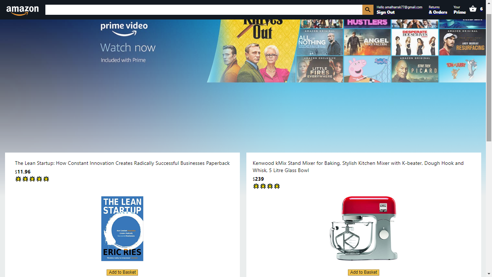

# Table of content

-   **[About](#about)**
-   **[Use It Locally](#use-it-locally)**
-   **[App Demo](#app-demo)**

<a name="about"></a>

# About

The App is called "amazon-clone" using reactjs, covers an entire e-commerce solution: 

-   from design, authentication to payment.

<a name="use-it-locally"></a>

# Use It Locally

```
    
    npm start 
```

Runs the app in the development mode.\
Open [http://localhost:3000](http://localhost:3000) to view it in the browser.

<a name="app-DEMO"></a>

# App Demo


